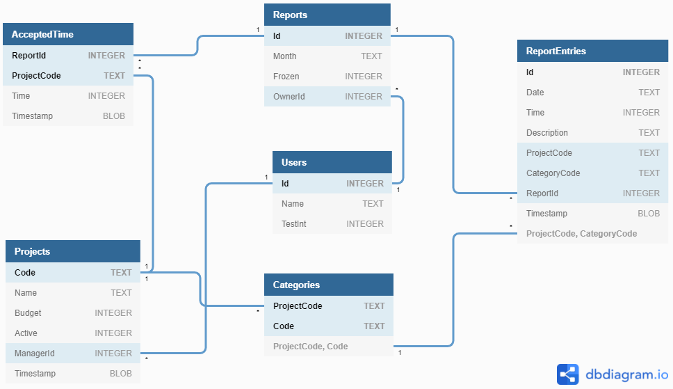

# Time Reporting System (database storage and concurrency handling)

Framework: ASP.NET Core 6.0 MVC with Entity Framework Core 6.0

## Data format

Data is stored in a SQLite database file in [storage](storage) directory: [trs.db](storage/trs.db).

Database diagram:


Concurrency handling is timestamp-based. Unfortunately, Microsoft.EntityFrameworkCore.Sqlite provider includes no support for such a function. Because of this, blobs randomly generated by triggers are used as concurrency tokens.

## Running

ASP.NET Core 6.0 Runtime is required in order to run the application. You can get it [here](https://dotnet.microsoft.com/en-us/download/dotnet/6.0).

After entering the directory using CLI, execute the following line:
```
dotnet run
```
