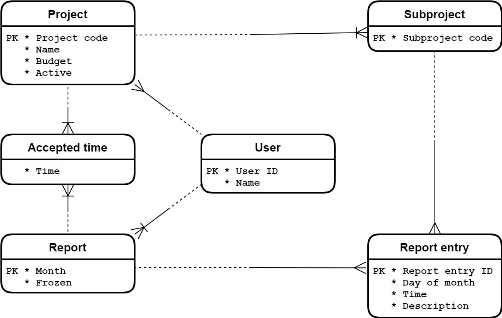

# Time Reporting System (database storage and concurrency handling)

Back-end framework: ASP.NET Core 6.0 Web API with Entity Framework Core 6.0

Front-end libraries: TypeScript, React.js, Bootstrap

## Trimmed functionality
Due to the tight schedule, the following functions have been cut from the final release:
- project creation,
- project summary view (including "acceptation" of work time of employees),
- concurrency handling.

## Data format

Data is stored in a SQLite database file in [storage](storage) directory: [trs.db](storage/trs.db).

ERD:


## Running

ASP.NET Core 6.0 Runtime is required in order to run the application. You can get it [here](https://dotnet.microsoft.com/en-us/download/dotnet/6.0).

Also, current LTS version of Node.js (ie. 12, 14 or 16) is needed for building the front end.

After entering the directory using CLI, execute the following line:
```
dotnet run
```

### Publishing (and running)
```batch
dotnet publish -c Release

cd .\bin\Release\net6.0\publish
.\Trs.exe
```
